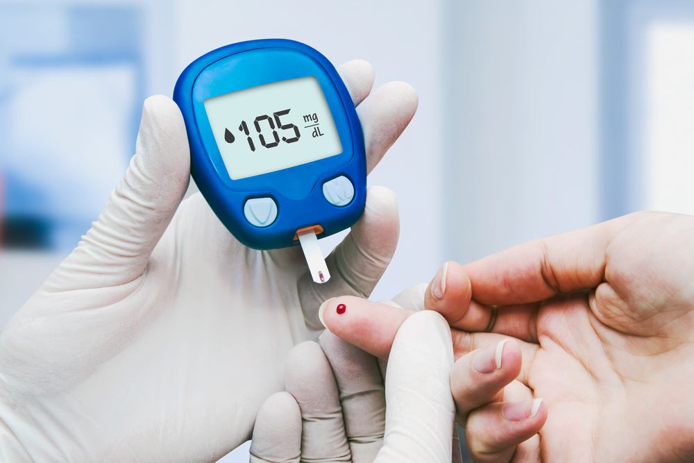

# Diabetes Prediction Web Application


<a href="https://jmhasan1.github.io/Jahid_Portfolio/" target="_blank">Diabetes Prediction Web APP</a>    

## Overview

This project is a web application designed to predict the likelihood of diabetes in individuals based on various health parameters. The application leverages a machine learning model trained on a dataset of health metrics, enabling users to input their data and receive predictions about their diabetic status.

## Features

- **User-Friendly Interface**: A simple and intuitive interface for users to input their health data and receive instant predictions.
- **Machine Learning Model**: The prediction engine is powered by a well-trained machine learning model that has been optimized for accuracy.
- **Real-Time Prediction**: Users can get real-time results and insights based on their inputs.

## How It Works

1. **Input Data**: The user inputs relevant health data, such as glucose levels, BMI, age, and more.
2. **Model Prediction**: The input data is processed through a trained machine learning model that predicts the likelihood of diabetes.
3. **Output**: The application displays the prediction, indicating whether the user is likely to be diabetic or not.

<!-- <!-- Replace with an actual image link -->

## Installation and Setup

Follow these steps to set up the project locally:

### Prerequisites

- Python 3.x
- Pip (Python package manager)
- Virtualenv (optional, but recommended)

### Installation

1. **Clone the Repository**
   ```bash
   git clone https://github.com/jmhasan1/Diabetes_Prediction.git
   cd Diabetes_Prediction
